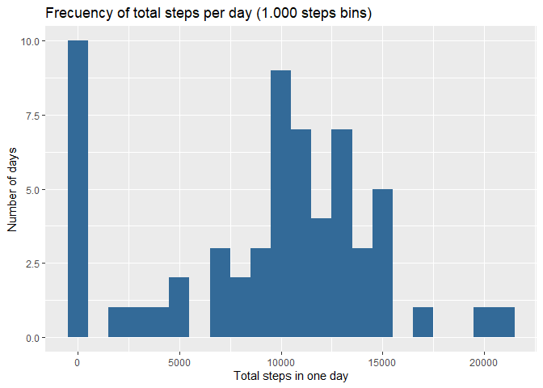
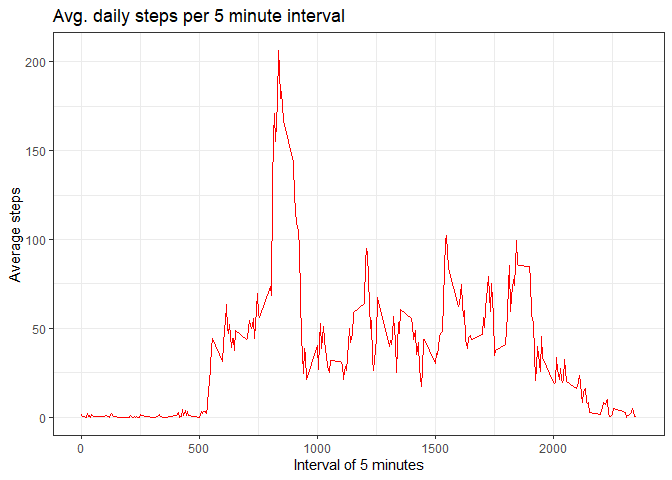
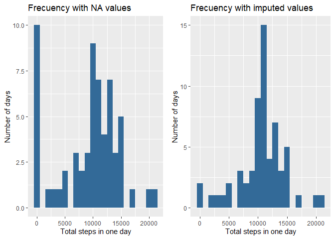
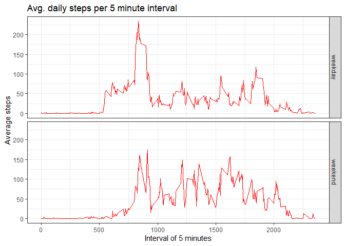

## Introduction

This document is Marc Arroyo's proposed solution to the **Course Project 1** of the course **Reproducible Research** corresponding to the Data Science Specialization offered by Johns Hopkins University via Coursera.

Please read the README document to have a clear view on the full content of this repository.

## Preparing Environment

First thing we will do is to load required libraries and set the echo parameter to TRUE in order to not specify it in every chunk. Libraries to use are:  

        - knitr in order to process the document and transform it to html
        - dplyr in order to manage dataframes
        - ggplot2 in order to create grahics
        - lubridate in order to convert char and int to dates and times
        - gridExtra in order to arrange ggplot2 graphs side by side
To set the echo parameter to TRUE we will use the opts_chunk$set instruction from knitr library. We will also indicate as a default option to not print messages or warnings in the final document and to stop in case of error in the code execution and not continue with the document.

Finally we will use one code line to set the locale language to English, as mine it is not.


```r
library(knitr)
library(dplyr)
library(ggplot2)
library(lubridate)
library(gridExtra)

opts_chunk$set(echo = TRUE, message = FALSE, warning = FALSE, error = FALSE)

Sys.setlocale("LC_ALL", "English")
```

## Loading and preprocessing the data

As the data is contained in the repository in zip format, we will check the existence of the file, and read it in case positive or unzip it and read it in case negative.

We will also make two changes to the data frame:
        1. Add datetime variable that will be the date and time pasted in the POSIXct format.
        2. Transform the column date from chr to Date format

Finally, we will show the resulting dataframe *(activity)* using str function.


```r
if (!file.exists("activity.csv")){
        unzip("activity.zip")
}

activity <- read.csv("activity.csv")

activity <- mutate(activity, datetime = ymd(date) + 
                           seconds_to_period(interval*60), date = ymd(date))

str(activity)
```

```
## 'data.frame':	17568 obs. of  4 variables:
##  $ steps   : int  NA NA NA NA NA NA NA NA NA NA ...
##  $ date    : Date, format: "2012-10-01" "2012-10-01" ...
##  $ interval: int  0 5 10 15 20 25 30 35 40 45 ...
##  $ datetime: POSIXct, format: "2012-10-01 00:00:00" "2012-10-01 00:05:00" ...
```

## What is mean total number of steps taken per day?

### Total number of steps per day

As a first part of this section, we will calculate the total number of steps per day. Given the transformation we have done to the *date* field in our data file, that will be direct using dplyr capabilities, and we will show the data frame created *(Totstepxday)*.


```r
Totstepxday <- activity %>% group_by(date) %>% summarise(Totstep = sum(steps, na.rm = TRUE))

str(Totstepxday)
```

```
## tibble [61 x 2] (S3: tbl_df/tbl/data.frame)
##  $ date   : Date[1:61], format: "2012-10-01" "2012-10-02" ...
##  $ Totstep: int [1:61] 0 126 11352 12116 13294 15420 11015 0 12811 9900 ...
```

### Histogram of the total number of steps taken each day

In order to have a closer look at the frequency distribution of steps per day we will create an histogram using capabilities of the loaded package ggplot2. As steps range from 0 to more than 20.000 steps in one single day, we will adjust the binwidth parameter to 1.000 steps. In that way we will see the number of days with -501 steps to +500 steps, from 501 to 1.500, from 1.501 to 2.500, and so on.


```r
qplot(Totstep, data = Totstepxday, geom = "histogram", fill = 2, main = "Frecuency of total steps per day (1.000 steps bins)", xlab = "Total steps in one day", ylab = "Number of days", binwidth = 1000, show.legend = FALSE)
```

<!-- -->

### Mean and median of steps per day

And finally we will characterize a little bit better the total steps per day using the summary function.


```r
t <- prettyNum(summary(Totstepxday$Totstep))
```

The mean of steps per day is **9354.23** and their median is **10395**. 

As we have seen in the end of data preprocessing section, there are some NA's in steps, and because the minimum value is **0** we know that there are some days without any measurement.

Other measures are the day with the most steps registered has **21194** steps, and the 1st Quartile is **6778** and the 3rd Quartile is **12811**.

## What is the average daily activity pattern?

### Make a time series plot of the average number of steps taken for every 5-minute interval

In order to build the plot we will use the fact that we didn't transform the *interval* field of *activity* file. We will use ggplot2 to create the plot.


```r
Totstepx5min <- activity %>% group_by(interval) %>% summarise(Avgstep = mean(steps, na.rm = TRUE))

ggplot(data=Totstepx5min, aes(x=interval, y=Avgstep)) +
        geom_line(color = "red") +
        theme_bw() +
        labs (title = "Avg. daily steps per 5 minute interval") +
        labs (x = "Interval of 5 minutes", y = "Average steps")
```

<!-- -->

### 5-minute interval with the highest average steps across all days

To determine the 5 minute interval with the highest average steps we will simply look for the interval with the maximum value of average steps, and we will transform it to hours and minutes to have the moment of the day more clear.


```r
MaxInt <- Totstepx5min$interval[Totstepx5min$Avgstep == max(Totstepx5min$Avgstep)]

MaxTimeSta <- as.character(seconds_to_period(MaxInt*60))
MaxTimeEnd <- as.character(seconds_to_period((MaxInt+5)*60))
```

The highest average daily steps are registered in the interval **835**, that corresponds from **13H 55M 0S** to **14H 0M 0S**.

## Imputing missing values

### Calculate and report the total number of missing values in the dataset

In order to evaluate the missing values we will sum the NA values in the column *steps* of the *activity* data frame and we will obtain the proportion of NA in that field.


```r
missval <- sum(is.na(activity$steps))

pctmissval <- round(missval*100/nrow(activity), digits = 2)
```

The number of missing values is **2304**, representing the **13.11%** of the total observations, an important percentage that can create byas in some evaluations.

### Devise a strategy to impute missing values and put it in a new dataset

In order to impute missing values, the strategy to follow will be to assign to every missing value the average value for the corresponding interval that we have calculated in the *Totstepx5min* table.

To do so, we will copy the original information to a new data frame, *Imputeact*, and use a for loop with an if condition, if the *steps* value in a given row is NA we will assign the value of the corresponding interval in the *Totstepx5min* data frame. Doing so, *Imputeact* will be as our original data, but with the NA values replaced by correct values.


```r
Imputeact <- activity

for (i in 1:nrow(Imputeact)){
        if (is.na(Imputeact$steps[i])) {
                Imputeact$steps[i] <- Totstepx5min$Avgstep[Totstepx5min$interval == Imputeact$interval[i]]
        }
}

str(Imputeact)
```

```
## 'data.frame':	17568 obs. of  4 variables:
##  $ steps   : num  1.717 0.3396 0.1321 0.1509 0.0755 ...
##  $ date    : Date, format: "2012-10-01" "2012-10-01" ...
##  $ interval: int  0 5 10 15 20 25 30 35 40 45 ...
##  $ datetime: POSIXct, format: "2012-10-01 00:00:00" "2012-10-01 00:05:00" ...
```

And, now we can check that there are no missing values in *Imputeact*.


```r
sum(is.na(Imputeact$steps))
```

```
## [1] 0
```

### Histogram of the total number of steps taken each day without NA values

We will recreate the same histogram we've already done above using ggplot2, but with the new dataframe *Imputeact*. As steps range from 0 to more than 20.000 steps in one single day, we will adjust the binwidth parameter to 1.000 steps. In that way we will see the number of days with -501 steps to +500 steps, from 501 to 1.500, from 1.501 to 2.500, and so on.


```r
TotstepxdaywoNA <- Imputeact %>% group_by(date) %>% summarise(Totstep = sum(steps))

Newhist <- qplot(Totstep, data = TotstepxdaywoNA, geom = "histogram", fill = 2, main = "Frecuency with imputed values", xlab = "Total steps in one day", ylab = "Number of days", binwidth = 1000, show.legend = FALSE)

NAhist <- qplot(Totstep, data = Totstepxday, geom = "histogram", fill = 2, main = "Frecuency with NA values", xlab = "Total steps in one day", ylab = "Number of days", binwidth = 1000, show.legend = FALSE)

grid.arrange(NAhist, Newhist, nrow=1)
```

<!-- -->

As we can observe, there is a change in the histogram, with more concentration arround the mean values, and couldn't be different, because the NA's have been replaced by the average value.

### Mean and median of steps per day and comparison with the data containing NA's

And finally we will characterize using the summary function the new set of data and will compare it against the previous values.


```r
s <- prettyNum(summary(TotstepxdaywoNA$Totstep))
```

The new mean of steps per day is **10766.19** against the **9354.23** of the values without imputation of NA's, and their median is **10766.19** against the original **10395**. 

Other are the 1st Quartile that move from **6778** originally to **9819** now. But we can observe that the 3rd Quartile was **12811** and now is **12811**, and the max value was **21194** and now continues to be **21194**. That fact confirms that the changes made are limited to change the NA's that have been set to the average values, that's why we have changes only in the lower part of the histogram.

## Are there differences in activity patterns between weekdays and weekends?

### Create a new variable to identify weekdays from weekend days

Based on the original dataframe *(activity)*, we will create a new dataframe *(activityModif)* with an additional column *(weekpart)*, initially set to *"weekday"*. With a for loop and the weekdays function we will update the value of Saturdays and Sundays to *"weekend"*. Finally we will convert *weekpart* into a factor variable as can be seen in the new dataframe *(activityModif)* structure.


```r
activityModif <- mutate(activity, weekpart = "weekday")

for (i in 1:nrow(activityModif)){
        if ( weekdays(activityModif$date[i], abbreviate = TRUE) %in%
             c("Sat", "Sun")) {
                activityModif$weekpart[i] <- "weekend"
        }
}

activityModif$weekpart <- as.factor(activityModif$weekpart)

str(activityModif)
```

```
## 'data.frame':	17568 obs. of  5 variables:
##  $ steps   : int  NA NA NA NA NA NA NA NA NA NA ...
##  $ date    : Date, format: "2012-10-01" "2012-10-01" ...
##  $ interval: int  0 5 10 15 20 25 30 35 40 45 ...
##  $ datetime: POSIXct, format: "2012-10-01 00:00:00" "2012-10-01 00:05:00" ...
##  $ weekpart: Factor w/ 2 levels "weekday","weekend": 1 1 1 1 1 1 1 1 1 1 ...
```

### Comparison on average activity between weekdays and weekend days

To know if there are differences on steps between weekdays and weekend days, we will create two plots averaging the steps in every interval of the day, one for weekdays and another for weekend days. In order to do so, we will use ggplot2 and their facet capabilities.


```r
Totstepx5minModif <- activityModif %>% group_by(weekpart, interval) %>% summarise(Avgstep = mean(steps, na.rm = TRUE))

ggplot(data=Totstepx5minModif, aes(x=interval, y=Avgstep)) +
        geom_line(color = "red") +
        facet_grid(weekpart~.) +
        theme_bw() +
        labs (title = "Avg. daily steps per 5 minute interval") +
        labs (x = "Interval of 5 minutes", y = "Average steps")
```

<!-- -->

As we can observe, the activity on weekdays starts earlier than in the weekend days, and has a bigger peak. On the other hand, in weekends, the activity is higher in daylight hours and descends less abruptly than in weekdays. Clearly the two figures are affected by working hours in weekdays. 
